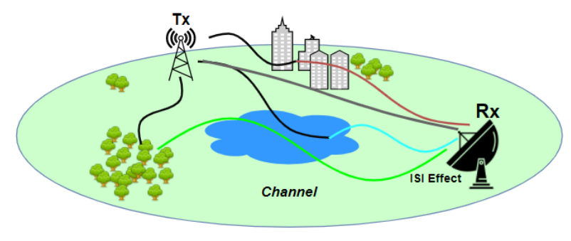
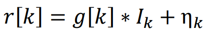
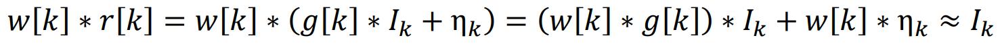
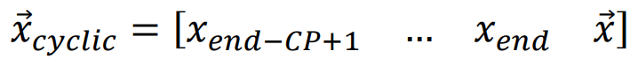
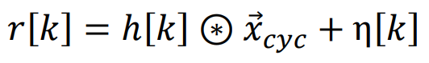
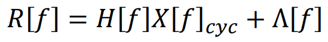
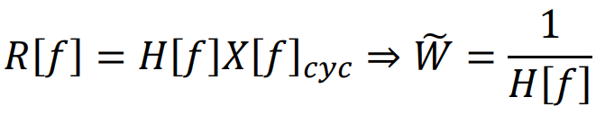
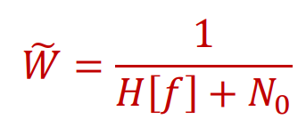
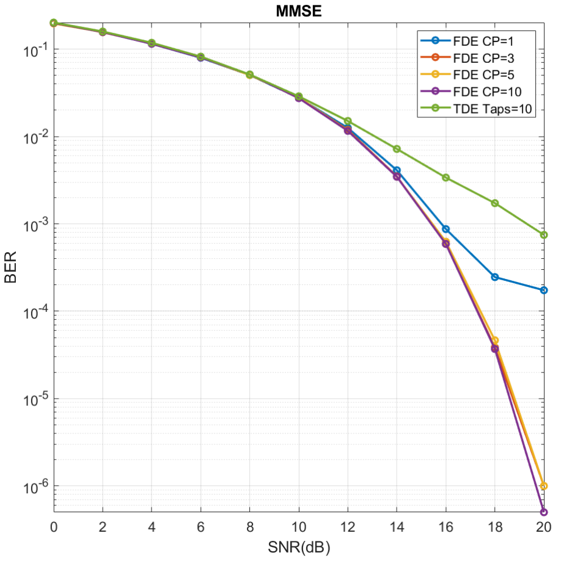
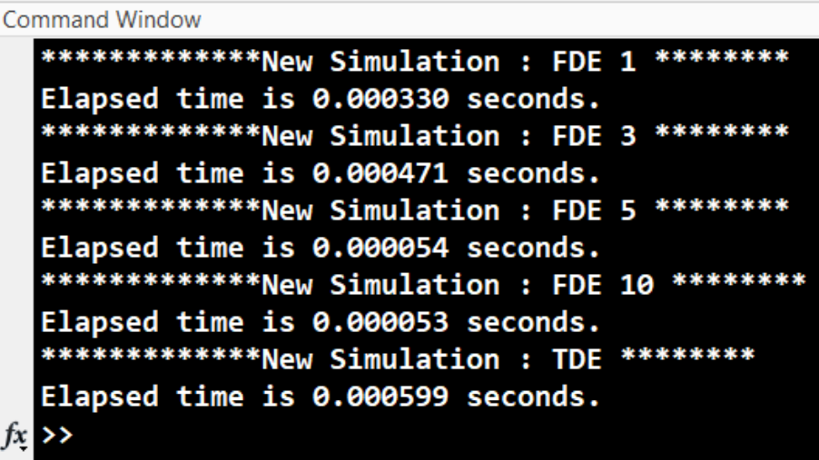

# Frequency Domain Equalization

In real life communication networks, the channels encountered are not quite representable by simple pulses. Instead, the channel is spread over different symbol instances with different magnitude and shape. A typical everyday ISI channel is shown in the figure below. To reduce the ISI effect coming from the channel, equalizers are utilized in the receiver (Rx) side. There are several equalizers such as Zero Forcing Equalizer, Minimum Mean Square Error Equalizer, Maximum Sequence Estimation Equalizer, Viterbi Algorithm etc. However, all of these equalizers are in time domain and has several disadvantages such as computational complexity and thus run-time. In this project, Frequency Domain Equalizer (FDE) in MMSE configuration (taking the noise into the consideration) will be implemented.

## Equalizer Estimation

Equalizers are simply algorithms that is designed to reduce the effect of the noise and ISI introduced by the channel. One can model communication system as the following:

Then equalizers are designed such that:

However, since this operation and finding optimal equalizer requires inverse matrix operations, it is quite computationally expensive operations. Thus, equalization will be done on the frequency domain to propose a solution. Before shifting to frequency domain and to utilize DFT operation, the convolution above need to be converted into the cyclic convolution. However, the transmitted signals need to be changed to apply cyclic convolution. Cyclic prefix is the symbol got from end of the data frame and added into the beginning of the data frame. By this addition, our data frame can be considered for cyclic convolution. To be concise, one can imagine cyclic prefix addition as follows:

The number of cyclic prefixes can be adjusted for design criteria. After converting x vector to be cyclic, following convolution can be applied.

Then by taking the DFT, one can get

If there were no noise, the equation would become:

However, it is Zero Forcing Equalizer in frequency domain, we need to take the noise into the consideration to realize MMSE in FD. By the following the mathematical flow discussed in page 643-647 of [the book](https://books.google.com/books/about/Digital_Communications.html?id=HroiQAAACAAJ#:~:text=Digital%20Communications%20is%20a%20classic,depth%20to%20cover%20two%20semesters.). In the page 647, it is concluded that MMSE in FD can be produced with following formula:

Then one can take the DFT of the incoming signal, multiply this filter and take IFFT to get approximate of the information bits.

## Implementation Details

The implementation of the project is given in the FDE.m script. The script is mainly built to realize Monte-Carlo simulation for specified channel with different number of cyclic prefixed information frames being equalized by Frequency Domain MMS Equalizer to 
get BER values and to compare the results with a time domain (TDE) MMSE with causal 10-taps. Simulation is run for each cyclic prefix in FDE and once for the TDE causal MMSE. FDE MMSE is produced by the equation above. Equalizer calculation done on each SNR value outside the while loop of the Monte-Carlo simulation to not effect the process speed which will be measured. The produced data frame with cyclic prefixes are transmitted by convolving with the channel and by summing up with an additive white gaussian noise of which power is predetermined. After receiving the incoming frames fft of the input withoutw cyclic prefix is taken, it is multiplied with the 
equalizer and the inverse fft is taken to produce output, if it is FDE version. Otherwise, incoming signal is processed with TD equalizer with 10-tap causal MMSE. Only design difference between ordinary and causal equalizers is its unit 𝑒⃗ vector has only 1 at the first row unlike its being in the middle in the non-causal ones. Besides this difference, the size of the H matrix is decreased 
from (N1+N2+M1+M2-1) to (N2+M2-1) automatically without any design change. tic and toc functions are measuring the run-time spent during equalization process. By measuring this time, computational complexity of the frequency and time domain can be compared with each other. Finally, the equalization is done on the incoming signals and corresponding bit error rates are calculated.

## Simulation Results

The Bit Error Curves for different configurations are plotted above. As on can see from the figure, as the number of Cyclic prefixes increases the signal estimation accuracy increases in high SNR values, which is an expected result since the cyclic convolution becomes more and more closer to ideal operation. Furthermore, frequency domain equalizers works better than time domain MMSE at high SNR values. It is also expected result because one can imagine frequency domain equalizer as infinite tap time domain equalizer. Since time domain equalizer has finite number of taps, it is obvious it tends to erroneous results more than infinite number of tap equivalents.
Furthermore, for low SNR values all equalizers give same BER values as expected because the frequency domain operation is preferrable mainly because of its computational efficiency. It is measured by measuring equalization time and the results are also given in the next page. As one can see from the results below, the frequency domain equalization is 10x faster than time domain equivalent and increase of CP slows down the process.

